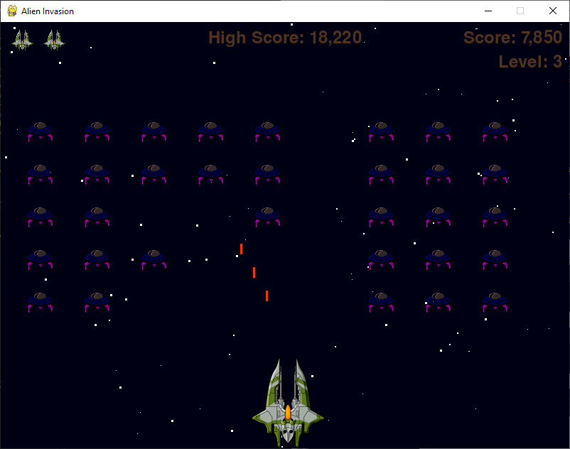

# Alien Invasion Game

The Alien Invasion Game is a Python project inspired by "Python Crash Course: A Hands-On, Project-Based Introduction to Programming" by Eric Matthes. It is a simple 2D arcade-style game built using the Pygame library. Your mission is to control a spaceship and fend off waves of invading alien spaceships.

## Table of Contents

- [Installation](#installation)
- [Game Overview](#game-overview)
- [Features](#features)
- [How to Play](#how-to-play)
- [Contributing](#contributing)
- [Credits](#credits)
- [License](#license)
- [Contact](#contact)

## Game Overview

In the Alien Invasion Game, you control a spaceship at the bottom of the screen. Your goal is to shoot down the alien spaceships that are advancing towards you. If any alien spaceship reaches the bottom of the screen or collides with your spaceship, you lose a life. The game continues until you run out of lives. Try to achieve the highest score by shooting down as many alien spaceships as possible!

## Features

- Real-time alien invasion action.
- Spaceship movement with left and right controls.
- Shooting bullets to destroy alien spaceships.
- Dynamic difficulty with increasing speed and alien count as you progress.
- High score tracking.
- Lifespan management (you start with a limited number of lives).
- Vibrant starry background.
- Play button to start and restart the game.

## How to Play

- Use the left and right arrow keys to move your spaceship.
- Press the space bar to shoot bullets.
- Avoid colliding with alien spaceships.
- Shoot down as many aliens as possible to earn points.
- Try to achieve the highest score and see if you can beat your previous high score.

## Contributing

If you would like to contribute to the Alien Invasion Game project, please follow these steps:

1. Fork the repository.
2. Create a new branch for your feature or bug fix.
3. Make your changes and commit them.
4. Push to your fork and submit a pull request.

## Credits

- Alien Invasion Game inspired by "Python Crash Course" by Eric Matthes.
- Game development and Pygame library

## License

This project is licensed under the MIT License - see the LICENSE file for details.

## Contact

For questions or support, feel free to contact us:

- Email: christophermashilo@gmail.com
- Project Repository: https://github.com/1Mashilo/Alien-Invasion

